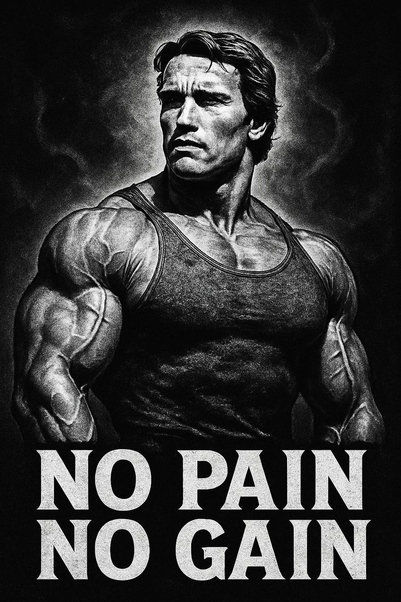

## 소개

- 타입 챌린지 풀이 저장소 🏭
- 어려운 타입 구현 역량 키우기 도전 🔥
- 모든 문제 풀이 해설지 공유 ⭐ [해설지 노션](https://uebermensch.notion.site/3a3b2d05c0ad42ba88c69cee05abdf12)

## 난이도 구분

- [warm-up](warm-up)
- [easy](easy)
- [medium](medium)
- [hard](hard)

타입 챌린지에 도전하는 개발자분들 화이팅입니다!👍🏻🏋️

